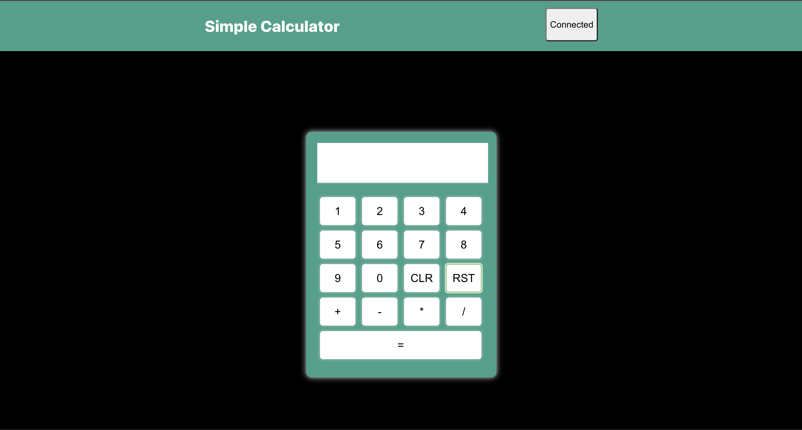

# Simple Calculator DApp

## Overview

A calculator DApp that was built with React.js, Hardhat, Solidity. The front-end is being hosted through [Fleek](https://fleek.co/) and the contract is deployed to Goerli Testnet. This DApp requires a MetaMask account in order to use the calculator. Grab some fake ETH [here](https://goerlifaucet.com/)

Contract address: 0xa79782b47d08730744d188578cdf0A5D0d62C657

I have also deployed this DApp to the zksync l2 testnet. Check it out [here](https://cool-math-7566.on.fleek.co/) to compare transaction speeds.

## Link to DApp

https://quiet-grass-6199.on.fleek.co

## Getting Started

Perform the following steps to run DApp locally.

To launch the React front-end

```md
npm run start
```

Launch hardhat server

```md
npx hardhat node
```

Deploy Smart Contract:

```md
npx hardhat run ./scripts/deploy.js --network localhost
```


